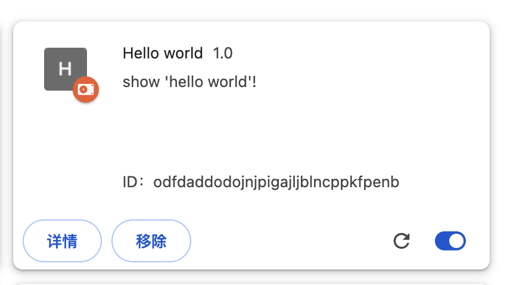
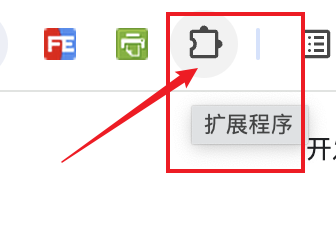
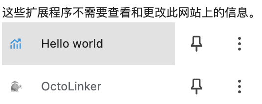
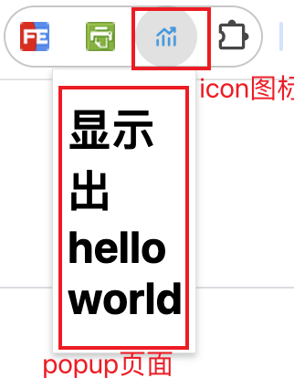
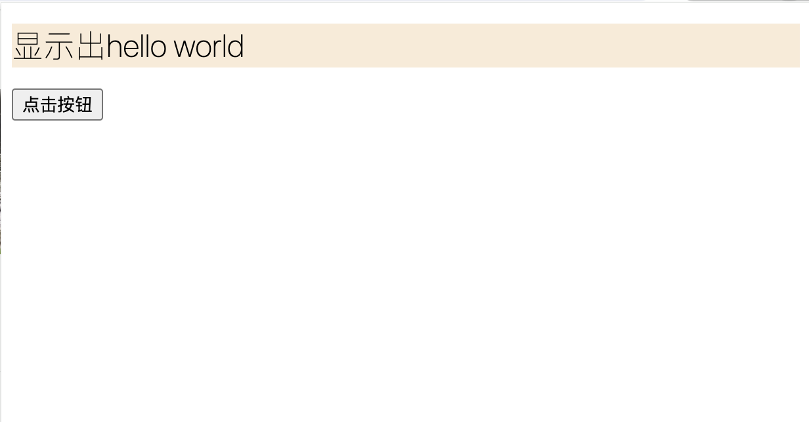
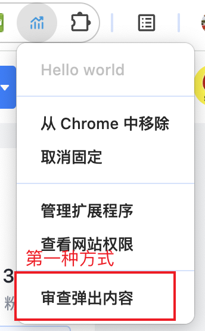
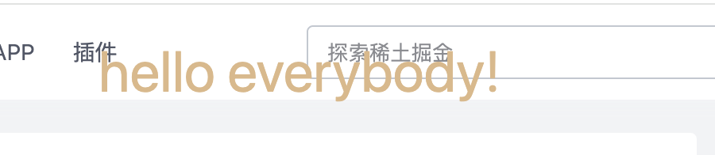

## chrome1入门开发，显示hello world
给manifest.json添加 action 配置default_popup，这样点击icon的时候，会打开一个popup页，并显示hello world
创建一个popup.html，内容为：
``` html
    <!DOCTYPE html>
    <html lang="en">
    <head>
        <meta charset="UTF-8">
        <meta name="viewport" content="width=device-width, initial-scale=1.0">
        <title>显示出hello world</title>
    </head>
    <body>
        <h1>显示出hello world</h1>
    </body>
    </html>
```

### 将 chrome1 安装到谷歌浏览器
安装方式是，直接将chrome1文件夹添加到到谷歌浏览器的扩展程序中，在扩展程序中打开开发者模式，然后加载已解压缩的扩展程序。

然后点击一个新的tab页面，点击插件扩展程序按钮

选择 刚才安装的 hello worrld 插件

点击该插件，会打开一个popup页面，显示hello world

至此完成了插件的开发、安装。完整代码在[这里](https://gitee.com/shenshuai89/learn-chrome-extension)

### action 配置
action 配置，是chrome1的扩展程序中最重要的配置。如果不添加action，那么chrome1的扩展程序将不能点击，放到插件上无任何反应。
manifest.json 中的 action 配置如下：
``` json
"action": {
    "default_popup": "popup.html", 
    "default_title": "hello world", 
    "default_icon": {  
      "16": "/images/icon16.png",
      "32": "/images/icon32.png",
      "48": "/images/icon48.png",
      "128": "/images/icon128.png"
    }
  },
```

### 给popup页面设置js脚本、css样式
在popup.html中添加如下代码：
``` html
<!DOCTYPE html>
<html lang="en">

<head>
    <meta charset="UTF-8">
    <meta name="viewport" content="width=device-width, initial-scale=1.0">
    <title>显示出hello world</title>
    <link rel="stylesheet" type="text/css" href="popup.css">
</head>

<body>
    <h1>显示出hello world</h1>
    <button id="clickBtn">点击按钮</button>
    <script src="popup.js"></script>
</body>

</html>
```
chome1的扩展程序中，popup.html页面是独立的，不能写内联样式或者内部执行js，必须引用js、css等文件。
添加 两个文件 popup.js、popup.css
popup.js 内容如下：
``` js
console.log(document.getElementById('clickBtn'));
document.getElementById('clickBtn').addEventListener('click', function () {
  console.log('clicked');
});
```
popup.css 内容如下：
``` css
h1 {
    background-color: antiquewhite;
    font-weight: 100;
}
```
查看效果：

查看js的执行效果有2种方式：
* 将插件固定到菜单，然后点击图标右键，点击审查内容

* 点击插件图标，弹窗出popup页面，然后在页面中右键点击检查按钮，和普通查看html页面的方式一样。

## 设置更改content 页面
新建文件夹 chrome2，将chrome1中的manifest.json、popup.html、popup.js、popup.css 复制到 chrome2 中。新增 content.js 和 content.css 文件。
content 页面是扩展程序中，真正要处理的页面，也是tab页中要展示的页面。
在manifest.json中添加content配置：
``` json
"content_scripts": [
    {
      "js": [ "content.js"],
      "css":[ "content.css" ],
      "matches": ["<all_urls>"]
    }
  ]
```
content.js 内容如下：
``` js
console.log('content.js hello everybody!');

let newDiv = document.createElement('div');
newDiv.innerHTML = 'hello everybody!';
newDiv.id = 'newDiv';
document.body.appendChild(newDiv);
```
content.css 内容如下：
``` css
#newDiv {
  font-size: 36px;
  color: burlywood;
  position: absolute;
  top: 20px;
  width: 100%;
  text-align: center;
  z-index: 9999;
}
```
这样就可以动态修改用户打开的页面了。

安装插件后，每打开一个页面就能看到 hello everybody! 的消息显示在页面上。

>>> content.js 文件中无法执行chrome.tab的相关API，比如 chrome.tabs.executeScript()、chrome.tabs.insertCSS()。